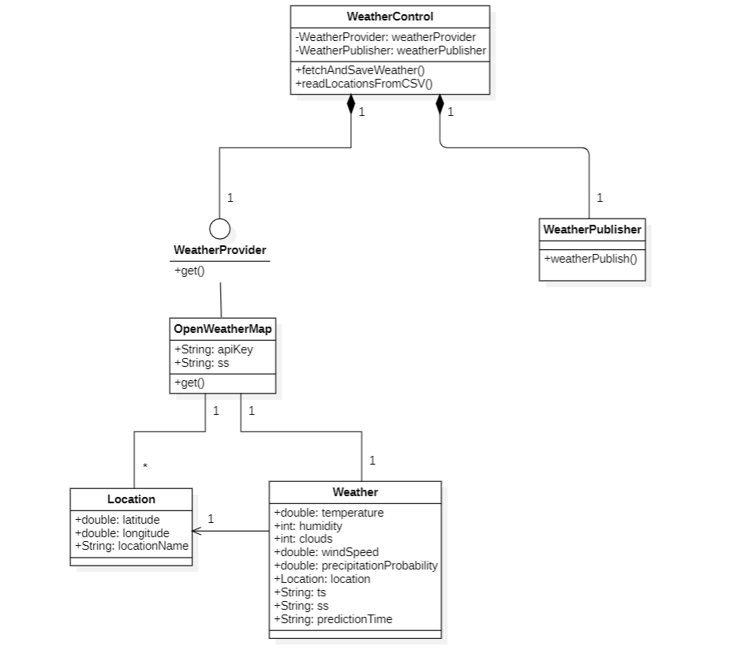
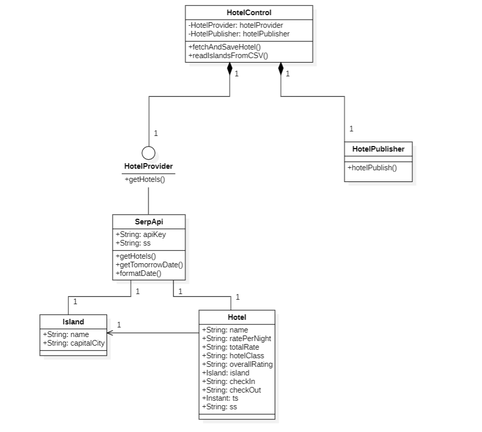
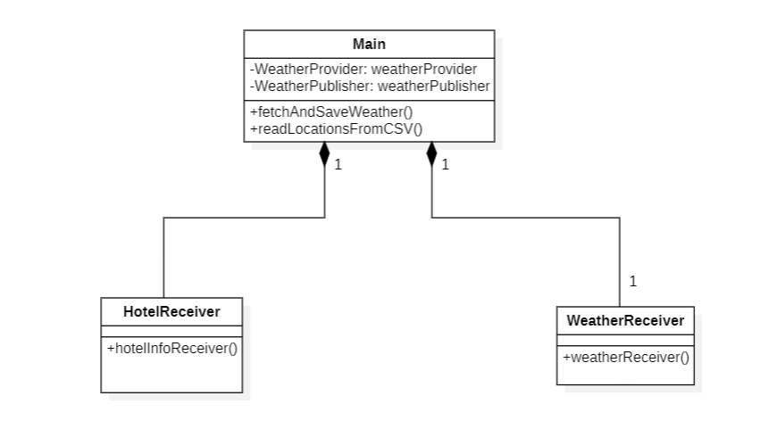
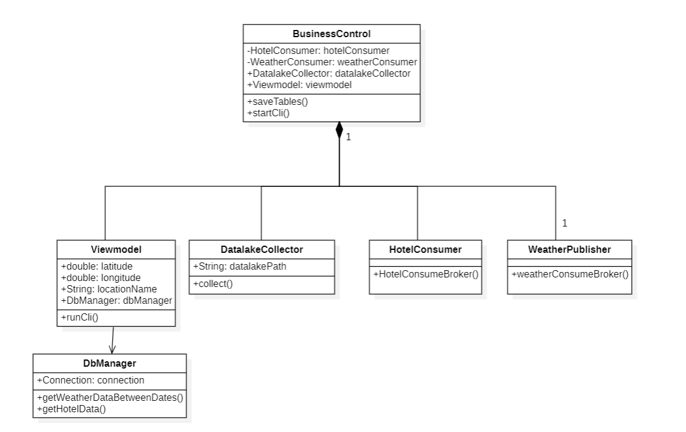

# Final Project

## DACD - 2º Data Science - EII - ULPGC

### Feauture summary

The project consist in an application that collects data from external sources, weather forecasts and hotel
availability, in order to show the user the different hotel reservation options and the weather so they can decide the
destination that best suits them.

The project has been divided into 4 modules whose functionality is explained below.

- PredictionProvider: in this module we use the OpenWeatherMap API to get the forecast information via an HTTP protocol.
The HTTP request will be executed every 6 hours for the next 5 days at 12pm. Then, we upload it to a broker that we have
hosted locally using ActiveMQ.
- HotelProvider: same as PredictionProvider but using the SerpApi API to get the needed information.
Now, the HTTP request will be executed every 72 hours, this is because SerpApi only allows 100 requests per month.
- DatalakeBuilder: this module has the task of connection to the broker and save the data sent from the previous modules.
- BusinessUnit: is connected to the broker to constantly update the information given to the user, this module is also
connected to the data lake just in case the broker gives no info, so the user always has information to consult.

In the design, a Kappa architecture is used so all the information handled is real-time, so we have no batch layer.
Applied to this project the incoming data is given by PredictionProvider and HotelProvider as well, on the other hand
the serving layer and the speed layer are the DatalakeBuilder and BusinessUnit respectively.

## Class diagram

## Execution requirements

For the correct execution of the application, the following points are neccesary.

- PredictionProvider: in main class, the 'args[0]' field must be the OpenWeatherMap API key.
- HotelProvider: in main class, the 'args[0]' field must be the SerpApi API key.
- DatalakeBuilder: in main class, the 'args[0]' field must be the path where the datalake will be saved and ending this
path in '/', for example: C:/AAAA/BBB/CCC/DDD/.
- BusinessUnit: in main class, the 'args[0]' field must be same path you gave in DatalakeBuilder.
- BusinessUnit: when the CLI interface is running, first, a number has to be introduced to select an option, then,
every word that are going to be written must begin in capital letters, for example "Las Palmas De Gran Canaria",
"La Gomera"... etc.
